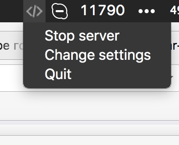
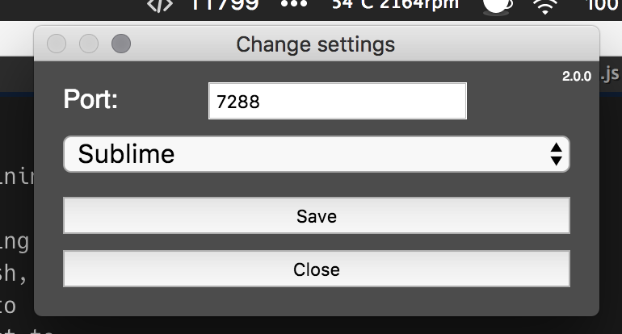

## Menubar Helper


Barebones simple server. 

Install it:


Configure it:




Set path to your favorite editor.

Now set your tools (extentions and stuff) to call:

```shell
  curl localhost:7288/openeditor?options='name-and-path-of-the-file.js:20:1'
```

And it will open your editor on specified line and column.
